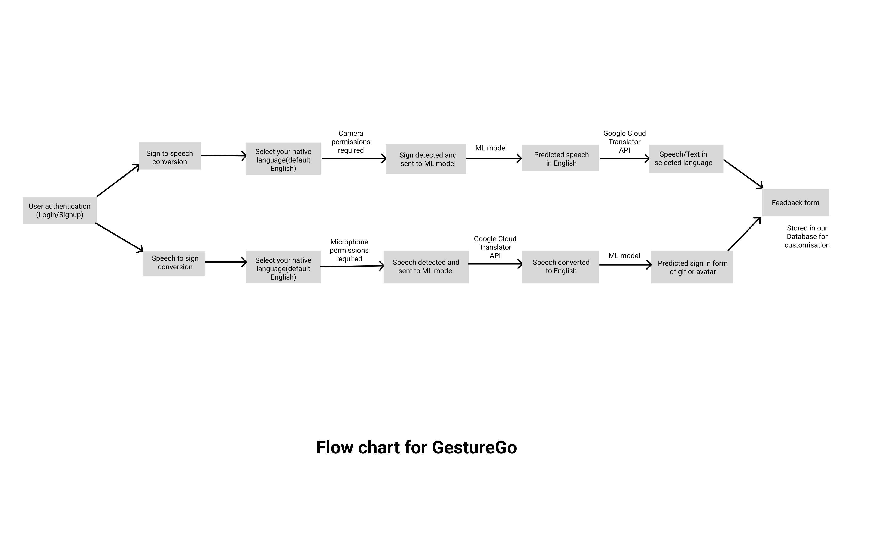

# GestureGo

## Problem Statement

All day to day activities require effective interpersonal communication
for both personal and professional settings. But people with hearing, visual
and speech impairments, find it extremely difficult to interact with others.

When over 1.5 billion people suffer from hearing loss around the world, deaf sign language users make up only about 0.1% of the total population in any given country. This can have a vastly negative impact on their mental health. Studies reveal that deaf/mute people are around twice as likely to suffer from psychological problems.

## Solution

We propose a web application, GestureGo, which will facilitate bidirectional communication between people with hearing or speech impairments and other people which in turn will lessen the communication gap between them and allowing everyone to understand and be understood.

## Flowchart

## Tech stack

- **FrontEnd:** [Django](https://www.djangoproject.com/) and [Tailwind CSS](https://tailwindcss.com/)
- **Other libraries:** [Tensorflow](https://www.tensorflow.org/), Pyaudio, Docker, Google Cloud Translator API
- **Cloud:** [AWS EC2]()
- **Version Control and Hosting:** [Git](https://git-scm.com/) for Source Code Management and [Netlify](https://netlify.com) for hosting

## Local Setup

- Fork and clone the repository.
- Add remote upstream `git remote add upstream https://github.com/varisha-025/GestureGo`

## Want to contribute?

Check out [CONTRIBUTING.md](CONTRIBUTING.md).
